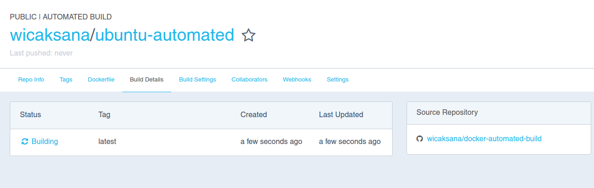
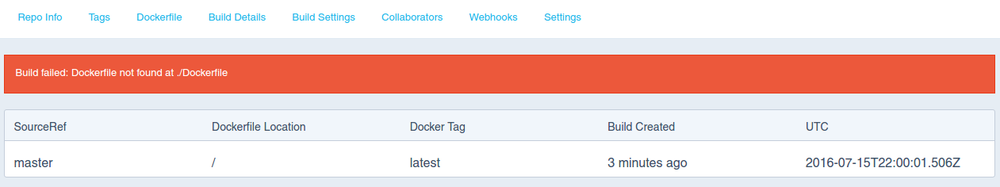
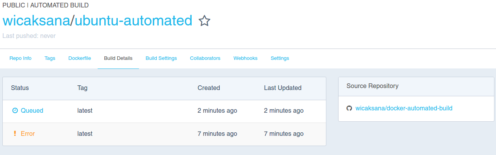
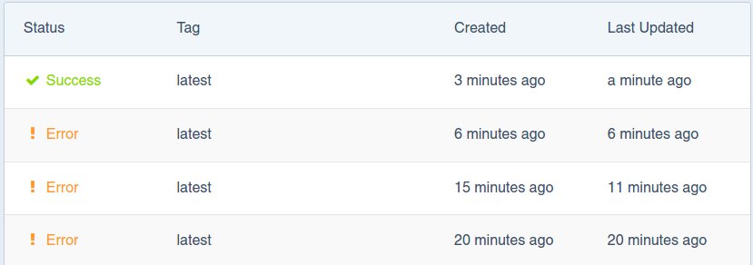
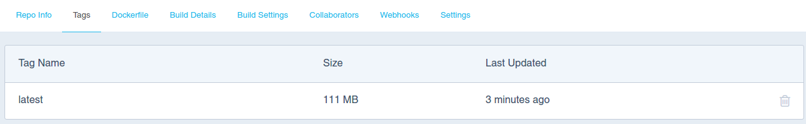

We can automate Docker build at Docker Hub via our commit on Github or
Bitbucket repository.

Github repository: [docker-automated-build](https://github.com/wicaksana/docker-automated-build)
Docker Hub repository: [wicaksana/ubuntu-automated](https://hub.docker.com/r/wicaksana/ubuntu-automated/)

Steps:
1. Too lazy to write the initial steps, so refer to [\[1\]](#ref1), up to Section [Understand the build process](https://docs.docker.com/docker-hub/builds/#/understand-the-build-process)
2. For example, I use `dockerfile` from [basic](../basic/) and put it on my repo [docker-automated-build](https://github.com/wicaksana/docker-automated-build)
3. After committing and pushing to Github, check the Docker Hub repository page to see if the image is being built:

4. Check on 'Build Details' tab to see if it works

5. Oops, I got an error! I made mistake. It shold be named after `Dockerfile`, instead of `dockerfile`. Rename it, commit, and repush. Now it is being queued:

6. After another few errors, finally I got succeed

### References:
1. [https://docs.docker.com/docker-hub/builds/](https://docs.docker.com/docker-hub/builds/)